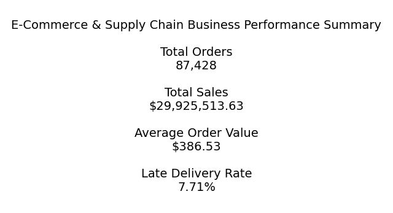
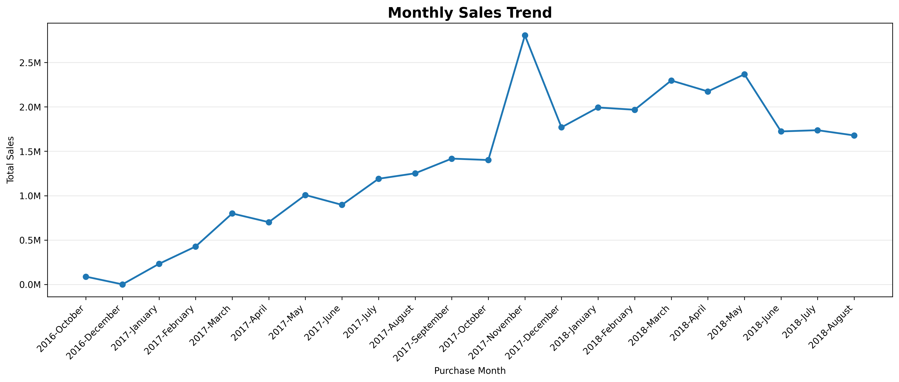
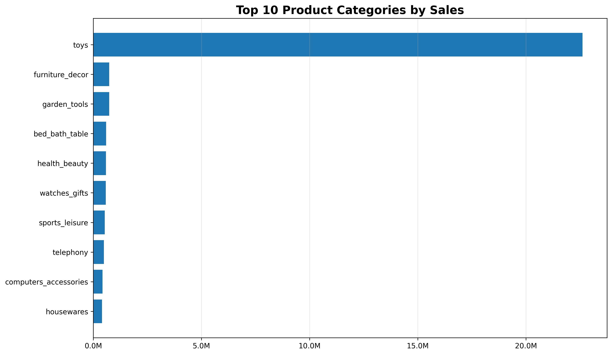
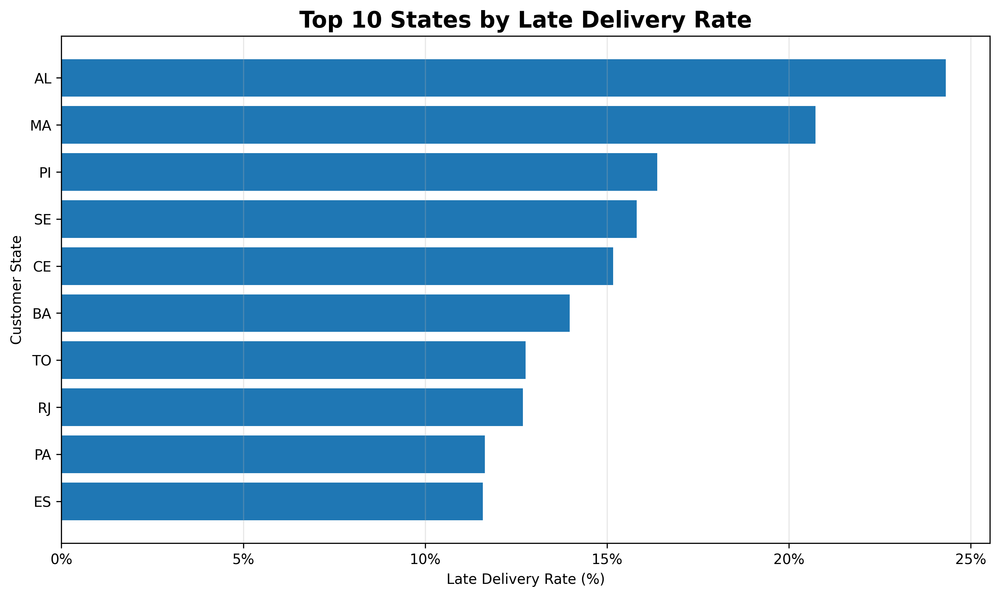
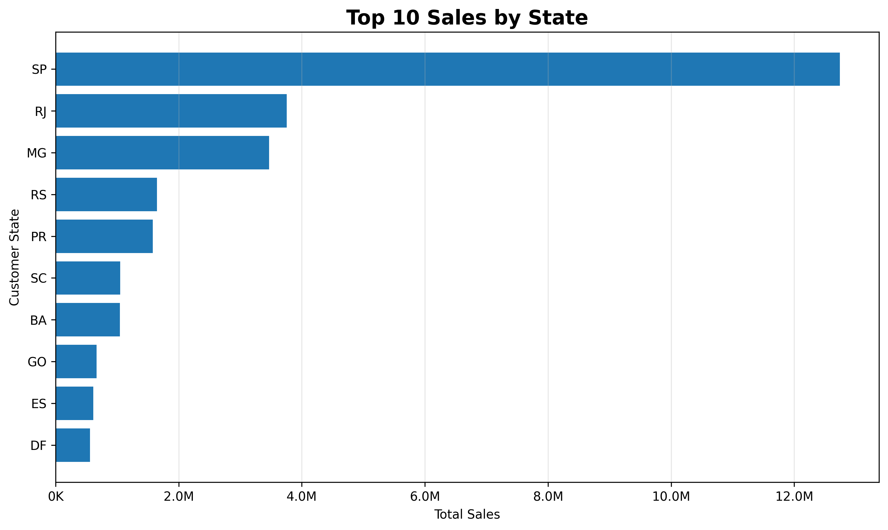
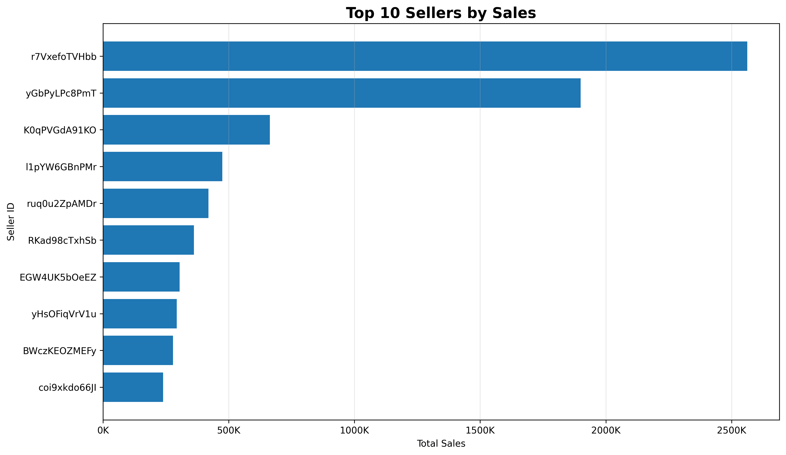
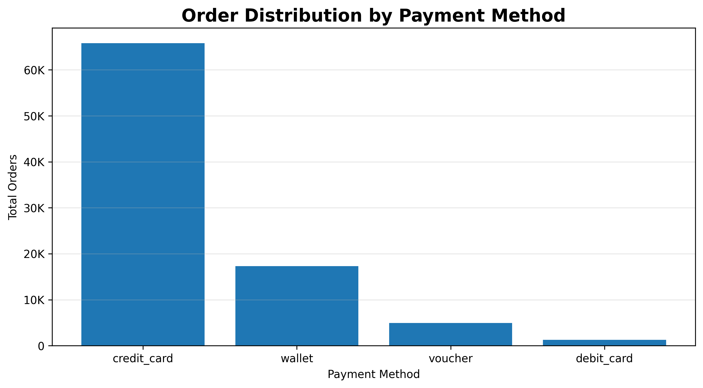
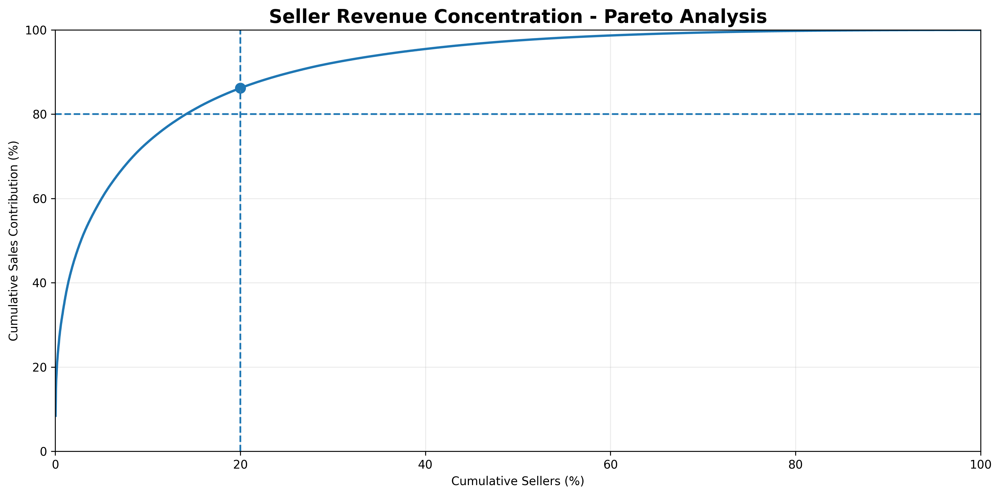
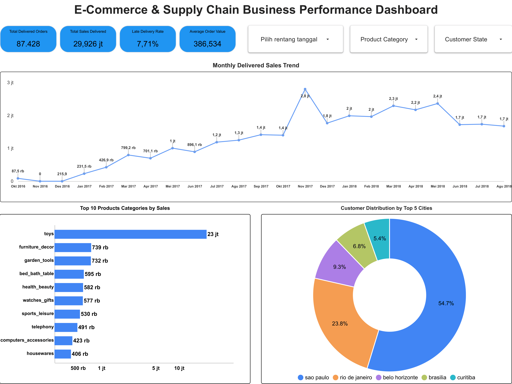
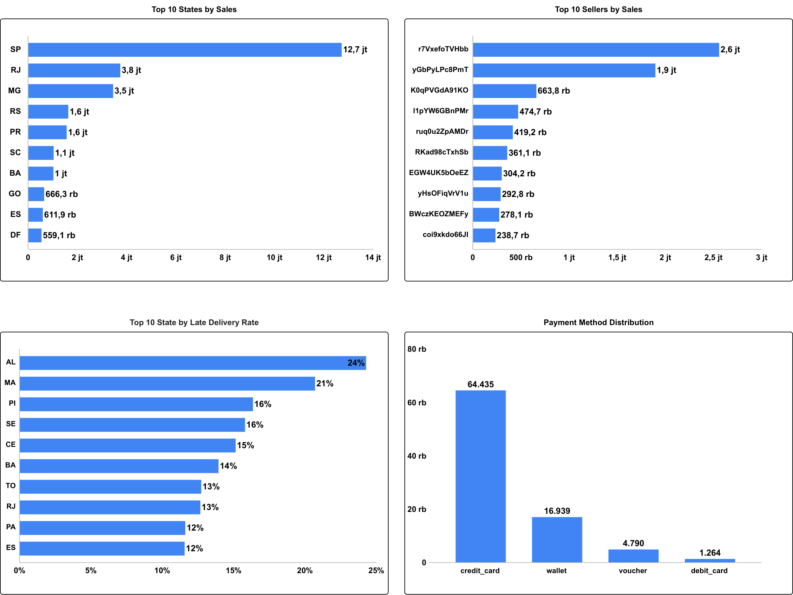

# E-Commerce Order & Supply Chain Performance Analysis

End-to-end data analytics project analyzing e-commerce transactions and supply chain performance using **Python, Google BigQuery SQL, and Matplotlib**.

The project covers data cleaning, feature engineering, relational SQL analysis, sales and product performance, logistics efficiency, seller performance, customer behavior, payment analysis, and advanced analytics.

---

## Project Overview

E-commerce performance is influenced by more than sales volume alone. Product demand, seller contribution, customer behavior, payment preferences, geographic concentration, and delivery efficiency can all affect overall business performance.

This project analyzes transactional and supply chain data to identify key business patterns and generate actionable insights.

### Objectives

- Evaluate overall sales and order performance.
- Identify high-performing products and categories.
- Analyze geographic business performance.
- Evaluate delivery and logistics efficiency.
- Measure seller contribution and delivery performance.
- Understand customer spending and payment behavior.
- Analyze seller revenue concentration using Pareto Analysis.

---

## Dataset

The project uses five relational datasets:

| Dataset | Description |
|---|---|
| Orders | Order status, purchase date, and delivery information |
| Order Items | Product, seller, price, and shipping information |
| Products | Product category, dimensions, and weight |
| Customers | Customer city and state information |
| Payments | Payment method, installments, and payment value |

The raw datasets contain approximately **89K transaction records**.

After validating duplicated product records, the Products dataset was reduced to **27,451 unique products**.

---

## Tools & Technologies

- **Python**
- **Pandas**
- **NumPy**
- **Matplotlib**
- **Google Colab**
- **Google BigQuery**
- **SQL**
- **Google Looker Studio**

---

## Analysis Workflow

### 1. Data Understanding & Preparation

Python was used to:

- Inspect dataset structure and data types.
- Identify missing values and duplicated records.
- Validate numerical and categorical variables.
- Convert date columns into datetime format.
- Validate relationships between datasets.
- Perform feature engineering.

New features included:

`purchase_year`  
`purchase_month`  
`purchase_day`  
`delivery_days`  
`delivery_status`  
`order_value`

---

### 2. SQL Business Analysis

Cleaned datasets were loaded into Google BigQuery for relational analysis.

The SQL analysis covered:

- Overall Business Performance
- Sales & Order Trend
- Product Category Performance
- Delivery & Logistics Performance
- Geographic Performance
- Seller Performance
- Payment Analysis
- Customer Spending Segmentation
- Pareto Analysis
- Product Ranking Performance

SQL techniques included:

`JOIN` • `CTE` • `CASE WHEN` • `COUNTIF` • `SAFE_DIVIDE` • `RANK()` • `LAG()` • Window Functions

---

# Key Analysis & Visualizations

## Executive Overview



The analysis identified approximately **87K delivered orders**, with an overall late delivery rate of approximately **7.71%**.

---

## Sales Performance



Monthly sales generally move in line with order volume.

**November 2017** recorded the highest monthly sales performance at approximately **2.81 million**, generated from **6,694 delivered orders**.

---

## Product Performance



Sales contribution varies significantly across product categories, highlighting the importance of identifying both high-value and high-demand categories.

---

## Delivery & Logistics Performance



Delivery performance varies across geographic regions, indicating that logistics challenges are not evenly distributed across states.

Regions with higher late-delivery rates may require further investigation into fulfillment and transportation bottlenecks.

---

## Geographic Performance



Customer activity and sales are concentrated in several key states, indicating that market demand is geographically uneven.

---

## Seller Performance



Seller contribution differs substantially across the marketplace, with several sellers generating significantly higher sales than others.

Seller performance should therefore be evaluated using both revenue contribution and operational delivery performance.

---

## Payment Behavior



Credit card is the dominant payment method used by customers in the dataset.

Payment behavior can provide additional insight into customer purchasing preferences and transaction patterns.

---

## Pareto Analysis



Pareto Analysis shows a strong concentration of revenue among top-performing sellers.

The **top 20% of sellers contribute approximately 86% of total sales**, showing that a relatively small group of sellers plays a significant role in marketplace revenue.

---

## Interactive Looker Studio Dashboard

An interactive business performance dashboard was developed in Looker Studio using Google BigQuery as the data source.

The dashboard provides an interactive overview of:

- Delivered orders and sales performance
- Average order value and late delivery rate
- Monthly delivered sales trends
- Product category performance
- Customer distribution by city
- State-level sales and delivery performance
- Seller performance
- Payment method distribution

Interactive filters were also implemented for date range, product category, and customer state.

### Executive KPI Dashboard



### Business Performance Dashboard



### Live Dashboard

[View Interactive Looker Studio Dashboard](https://bit.ly/e-commerce_supply_chain_dashboard)

---

# Key Insights

- Sales performance is strongly related to overall order volume.
- Revenue contribution differs significantly across product categories.
- Delivery performance varies across regions and sellers.
- Customer and sales activity is concentrated in several key geographic areas.
- Credit card is the most frequently used payment method.
- Marketplace revenue is highly concentrated among top-performing sellers.
- Pareto Analysis shows that the top 20% of sellers contribute approximately 86% of total sales.

---

# Business Recommendations

### Improve Demand & Inventory Planning
Prepare inventory and logistics capacity ahead of periods with higher transaction volume.

### Prioritize High-Performing Products
Use both sales value and order volume when determining inventory and promotional priorities.

### Improve Regional Logistics Monitoring
Investigate states with higher late-delivery rates to identify potential fulfillment or transportation bottlenecks.

### Strengthen Seller Performance Management
Monitor seller performance using both sales contribution and delivery performance.

### Maintain Strategic Seller Relationships
Since a relatively small proportion of sellers contributes a large share of total sales, maintaining strong relationships with top sellers can help protect marketplace performance.

### Develop Mid-Performing Sellers
Support medium-performing sellers to diversify revenue contribution and reduce excessive dependence on a small seller group.

### Optimize Payment Experience
Maintain a reliable credit-card payment experience while evaluating installment options for higher-value transactions.

---

# Skills Demonstrated

**Data Cleaning • Data Validation • Feature Engineering • SQL • BigQuery • Relational Analysis • CTE • Window Functions • KPI Analysis • Customer Segmentation • Pareto Analysis • Data Visualization • Business Insights • Dashboard Development • Data Storytelling**

---

# Project Structure

```text
ecommerce-order-supply-chain-analysis/
│
├── README.md
│
├── notebooks/
│   ├── ecommerce_order_supply_chain_analytics.ipynb
│   └── ecommerce_order_supply_chain_visualization.ipynb
│
├── sql/
│   └── ecommerce_analysis.sql
|   └── looker_dashboard.sql
│
└── images/
    ├── 01_executive_kpi.png
    ├── 02_monthly_sales_trend.png
    ├── 03_top_10_product_categories_by_sales.png
    ├── 04_top_10_states_by_late_delivery_rate.png
    ├── 05_top_10_states_by_sales.png
    ├── 06_top_10_sellers_by_sales.png
    ├── 07_payment_method_distribution.png
    └── 08_pareto_analysis.png
    └── 09_looker_studio_executive_kpi.png
    └── 10_looker_studio_business_performance.png
